👋 Hi, I’m Marcel Breuer

## Private Projekte

### [DockerSweep](https://github.com/marcel-breuer/docker-sweep)

Native macOS menu bar app for monitoring Docker storage and safely cleaning unused Docker resources. Built with Swift and SwiftUI.

